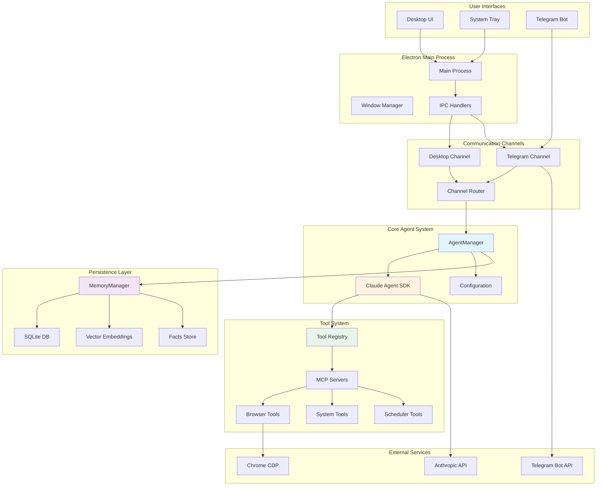
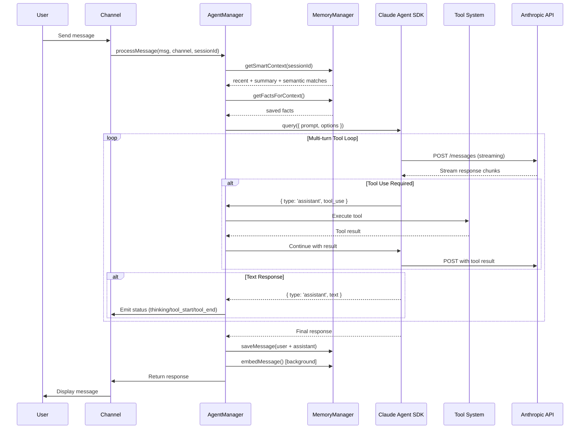
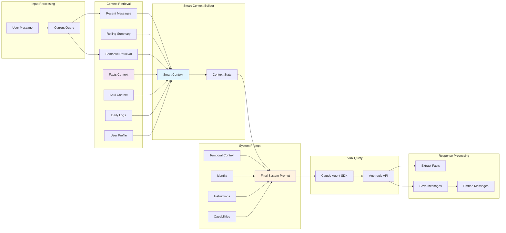
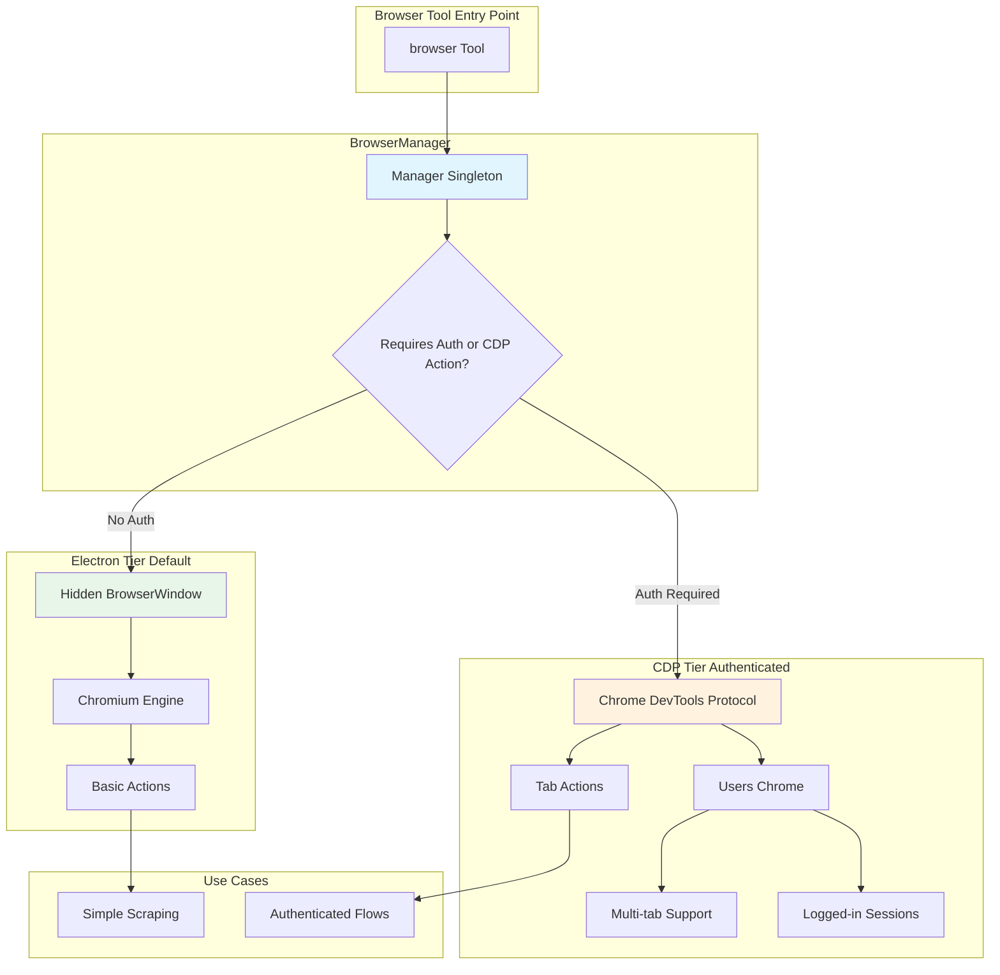
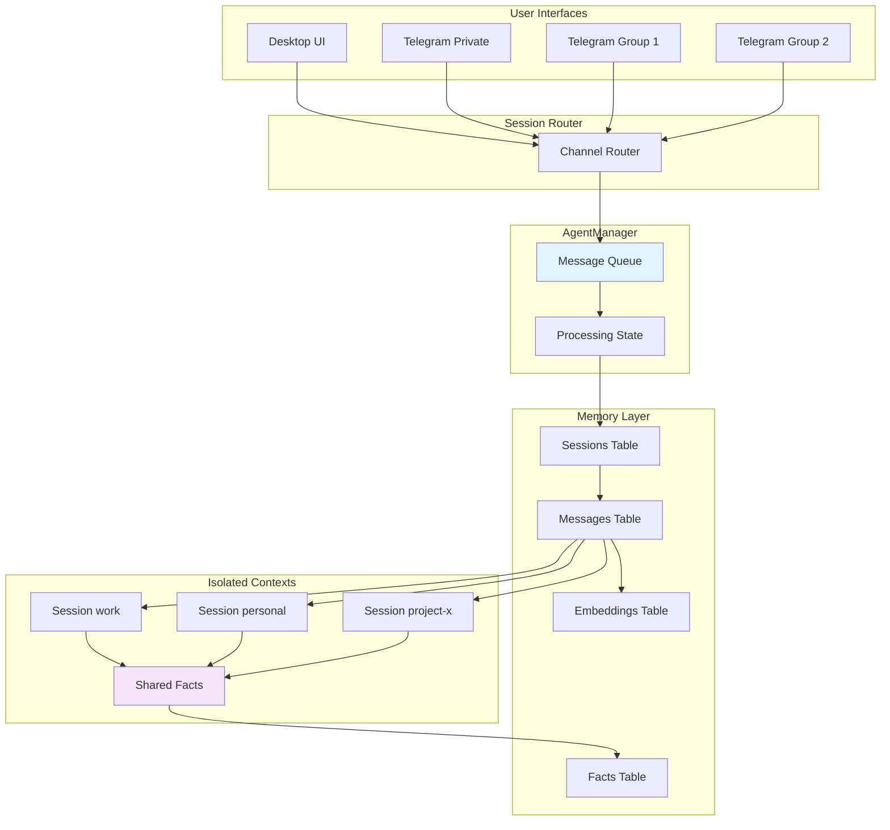
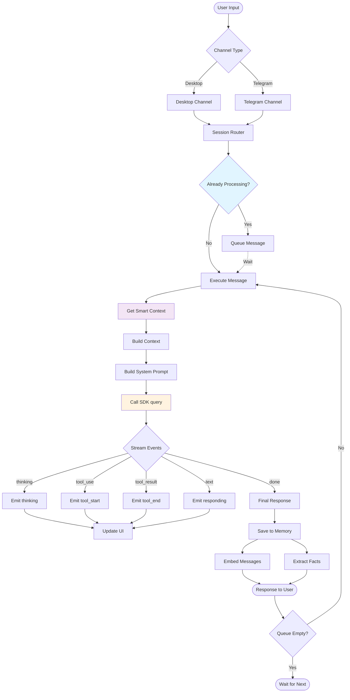

# Pocket Agent Architecture

## 1. High-Level System Architecture

## 2. Agent SDK Integration Flow

## 3. Tool System Architecture

```mermaid
graph TB
    subgraph ClaudeSDK[Claude Agent SDK]
        Query[query Function]
        Preset[claude_code Preset]
        MCPLoader[MCP Server Loader]
    end

    subgraph BuiltinTools[Built-in SDK Tools]
        Read[Read]
        Write[Write]
        Edit[Edit]
        Bash[Bash]
        Glob[Glob]
        Grep[Grep]
        WebSearch[WebSearch]
        WebFetch[WebFetch]
        Skill[Skill]
    end

    subgraph CustomMCP[Custom MCP Servers]
        subgraph InProcess[In-Process SDK MCP]
            BrowserTool[browser]
            NotifyTool[notify]
            PtyTool[pty_exec]
            MemTools[Memory Tools]
            SoulTools[Soul Tools]
            SchedTools[Scheduler Tools]
            CalTools[Calendar Tools]
            TaskTools[Task Tools]
        end

        subgraph ChildProcess[Child Process MCP]
            CompUse[computer]
            CustomMCP2[Custom MCP Servers]
        end
    end

    subgraph Handlers[Tool Handlers]
        BrowserMgr[BrowserManager]
        MacOS[macOS APIs]
        MemMgr[MemoryManager]
        CronMgr[CronManager]
    end

    Query --> Preset
    Query --> MCPLoader

    Preset --> Read
    Preset --> Write
    Preset --> Edit
    Preset --> Bash
    Preset --> Glob
    Preset --> Grep
    Preset --> WebSearch
    Preset --> WebFetch
    Preset --> Skill

    MCPLoader --> BrowserTool
    MCPLoader --> NotifyTool
    MCPLoader --> PtyTool
    MCPLoader --> MemTools
    MCPLoader --> SoulTools
    MCPLoader --> SchedTools
    MCPLoader --> CalTools
    MCPLoader --> TaskTools
    MCPLoader --> CompUse
    MCPLoader --> CustomMCP2

    BrowserTool --> BrowserMgr
    NotifyTool --> MacOS
    PtyTool --> MacOS
    MemTools --> MemMgr
    SoulTools --> MemMgr
    SchedTools --> CronMgr
    CalTools --> MemMgr
    TaskTools --> MemMgr

    style Preset fill:#fff3e0
    style MCPLoader fill:#e1f5ff
    style BrowserTool fill:#e8f5e9
    style MemTools fill:#f3e5f5
```

## 4. Memory & Context Management

## 5. Browser Automation Architecture

## 6. Multi-Session Architecture

## 7. Data Flow Summary

## Key Architecture Principles

1. **Singleton Pattern**: AgentManager, MemoryManager, BrowserManager (one instance per app lifecycle)

2. **Event-Driven**: Status events flow from Agent → Channels → UI for real-time feedback

3. **Session Isolation**: Each session has independent message history, but shares facts

4. **Queue-Based**: Per-session message queues prevent concurrent SDK queries (API limitation)

5. **Lazy Loading**: SDK loaded dynamically via ESM imports for CommonJS compatibility

6. **Tool Composition**: Built-in SDK tools (claude_code preset) + Custom MCP servers

7. **Smart Context**: Token-aware context assembly (recent + summary + semantic + facts)

8. **Background Tasks**: Embeddings and fact extraction run asynchronously

9. **Provider Abstraction**: Supports multiple LLM providers (Anthropic, Moonshot) via env vars

10. **Two-Tier Browser**: Electron (simple) + CDP (authenticated) based on requirements
